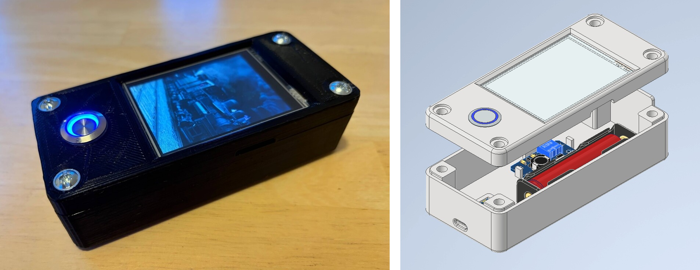

# LocoTV

LocoTV is a portrait video player device for children based on the Cheap Yellow Display (CYD). The project name originates from my nephew, who enthusiastically enjoys watching videos of old steam locomotives.

The device is housed in a [3D printed case](stl/) and plays a series of MJPEG files stored on an SD card. A [PowerShell script](00_convert.ps1) for batch downloading and video conversion is included in this repository.

For detailed instructions on wiring, the bill of materials, and assembly, please refer to the accompanying [blog post](https://jbetzen.net/posts/locotv/).

## Credits

+ [thelastoutpostworkshop](https://github.com/thelastoutpostworkshop) for provding the initial code: [esp32-2432S028_video_player](https://github.com/thelastoutpostworkshop/esp32-2432S028_video_player)
+ [https://github.com/kiwiholmberg](https://github.com/kiwiholmberg) for his fork with improved touchscreen support: [cyd-video-player](https://github.com/kiwiholmberg/cyd-video-player)
